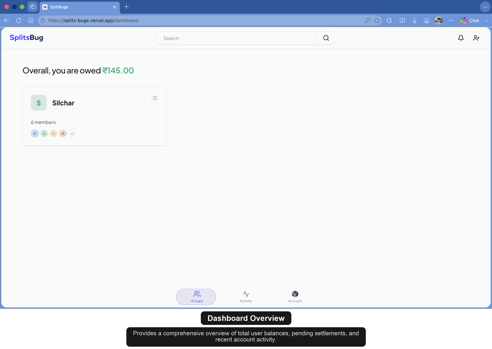

<div align="center">
  
  
  <p><strong>A modern, real-time expense splitting web application.</strong></p>
  
  <p>
    <a href="https://splits-bugs.vercel.app">Live Demo</a> •
    <a href="#features">Features</a> •
    <a href="#screenshots">Screenshots</a> •
    <a href="#tech-stack">Tech Stack</a> •
    <a href="#getting-started">Getting Started</a>
  </p>
</div>

<hr />

## About SplitsBug
SplitsBug is a fully-featured, full-stack expense tracker and bill-splitting application designed to make managing shared finances effortless. Whether you are splitting rent with roommates, travel expenses with friends, or dinners with a partner, SplitsBug calculates who owes what and keeps everyone in sync in real-time.

It acts as a complete, modern alternative to apps like Splitwise, built from the ground up with a premium dark-mode aesthetic and powerful group management tools.

## App Preview
<div align="center">
  
  
</div>

<br>

## Features
- **Real-Time Balances:** Add expenses and watch balances automatically recalculate instantly across all group members.
- **Advanced Group Management:** Create trips/groups, invite members, and assign custom roles (Admins can manage members and expenses; Viewers can only view balances).
- **Partial Settle-Up:** Don't want to pay the full debt at once? Members can input custom amounts to partially settle balances and keep the remainder pending.
- **Automated Email Notifications:**
  - Secure OTP verification for logins and new devices.
  - Group invitations.
  - Account deletion and survey feedback prompts.
- **Granular Notification Preferences:** Users can toggle which email notifications they want to receive (settlements, expenses, invites) directly from their settings.
- **Account Data Export:** Users can securely request and download all their data (groups, expenses, history) packed neatly into an `.xlsx` Excel file.
- **Premium UI:** Fully responsive, glassmorphism-inspired dark mode UI with micro-animations built using Tailwind CSS v4.

## Tech Stack
SplitsBug is built with modern, scalable web technologies:

- **Frontend Framework:** [Astro](https://astro.build/) (Server-Side Rendered)
- **Styling:** [Tailwind CSS v4](https://tailwindcss.com/)
- **Backend / Database:** [Firebase Firestore](https://firebase.google.com/products/firestore) (with strict Security Rules)
- **Authentication:** [Firebase Auth](https://firebase.google.com/products/auth) (Email OTP, Google Sign-In)
- **Emails / Delivery:** Nodemailer + Google SMTP
- **Data Export:** ExcelJS
- **Hosting / Deployment:** [Vercel](https://vercel.com/) (Serverless API functions)

---

## Getting Started

To run this project locally, follow these steps:

### 1. Clone the repository
```bash
git clone https://github.com/lotus-outlook-6/SplitsBugs.git
cd SplitsBugs
```

### 2. Install dependencies
```bash
npm install
```

### 3. Environment Variables
Create a `.env` file in the root directory and add your email credentials (required for the API route to send OTPs and notifications):
```env
SMTP_EMAIL=your_email@gmail.com
SMTP_PASSWORD=your_app_password
```
*Note: Firebase client configuration is handled in `src/firebase.ts`.*

### 4. Start the development server
```bash
npm run dev
```
The app will be running at `http://localhost:4321`.

---

## Security
SplitsBug handles financial and personal data carefully:
- **Firestore Security Rules:** Read/write operations are strictly locked down. Users can only read group data they are verified members of, and only Admins can delete expenses or groups.
- **New Device Alerts:** If a user logs in from a new or unrecognized device, they are immediately notified via email.
- **Data Retention Policy:** If a user deletes their account, their authentication data is wiped, but shared group expenses remain visible to other active members to preserve their financial history.

## License
This project is open-source and available under the [MIT License](LICENSE).
